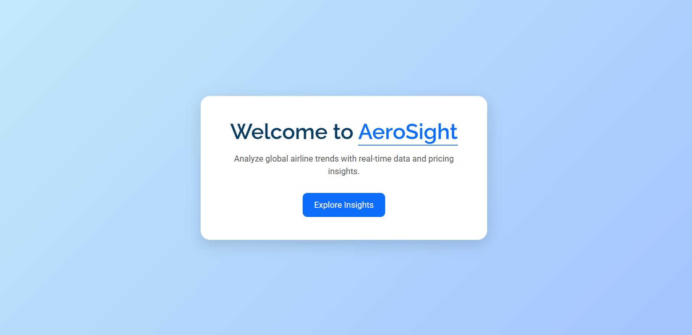
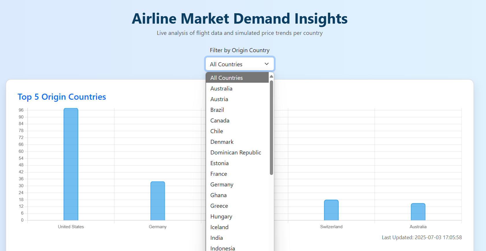
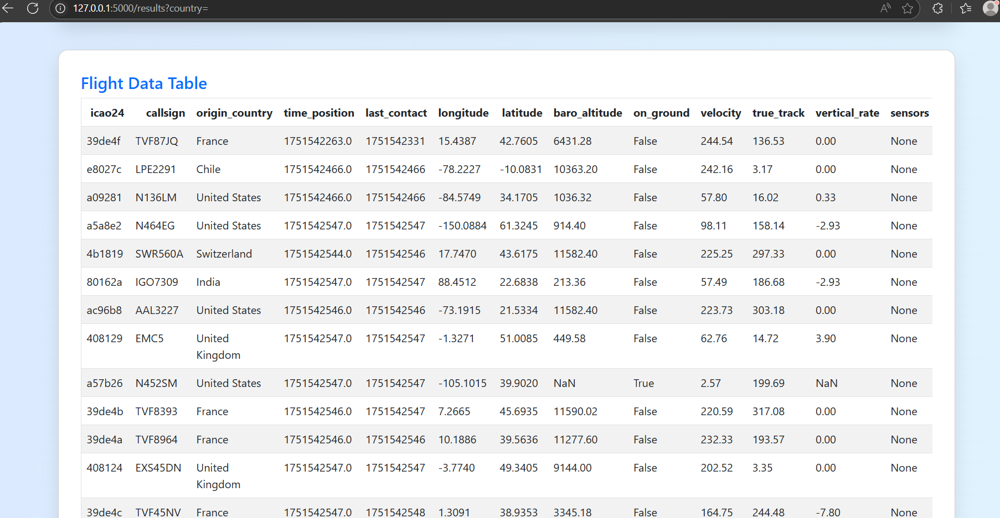

#  Aerosight – Airline Market Demand Insights

Aerosight is a lightweight Python web application built with Flask that visualizes live airline flight data using the OpenSky Network API. The dashboard provides real-time insights into flight demand, popular origin countries, and simulated price trends based on selected country filters.

---

##  Features

-  Real-time flight data fetched from [OpenSky Network API](https://opensky-network.org/)
-  Interactive bar chart for Top 5 Origin Countries
-  Simulated pricing trends by country (randomized)
-  Country-based filtering with dropdown
-  Last updated timestamp for data freshness
-  Clean and responsive UI using Bootstrap 5
-  Optimized with caching to reduce API calls

---
## 📸 Screenshots
screenshots/
├── homepage.png
├── results-page1.png
├── results-page2.png




---

##  Tech Stack

- **Backend**: Python 3, Flask
- **Frontend**: HTML, Bootstrap 5, Chart.js
- **APIs Used**: OpenSky Network (live flight data)
- **Extras**: `@lru_cache`, simulated price trends, responsive UI

---

##  How to Run Locally

```bash
git clone https://github.com/aditya8600/aerosight.git
cd aerosight
python -m venv venv
source venv/bin/activate  
pip install -r requirements.txt
python app.py
http://127.0.0.1:5000/
```

---

##  Requirements

```
Flask
requests
pandas
```

You can install them via:

```bash
pip install Flask requests pandas
```

---

## Project Structure

```
aerosight/
├── templates/
│   ├── index.html
│   └── results.html
├── static/
│   └── (optional assets)
├── app.py
├── requirements.txt
└── README.md
```

---

## Simulated Price Trends

The app generates random price values (₹200 – ₹800) for each top country on every refresh. This demonstrates pricing trend simulation, useful when real pricing APIs are not available for free.

>  Each country could be further improved by mapping with real currency codes and exchange rates.

---

##  Improvements & Suggestions

- Replace simulated price data with real APIs (Skyscanner, Amadeus, FlightAware)
- Add login/authentication for users
- Include departure/destination filtering
- Add multi-day trends and time-series analysis

---

##  License

This project is open-source and free to use for learning and non-commercial purposes.